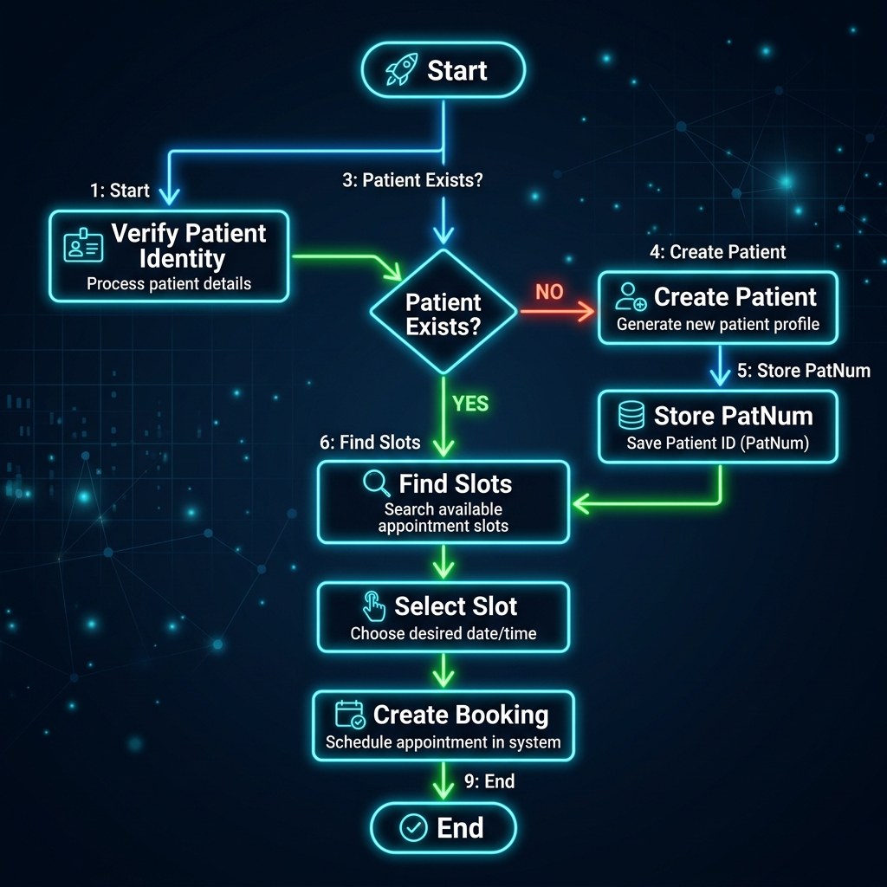
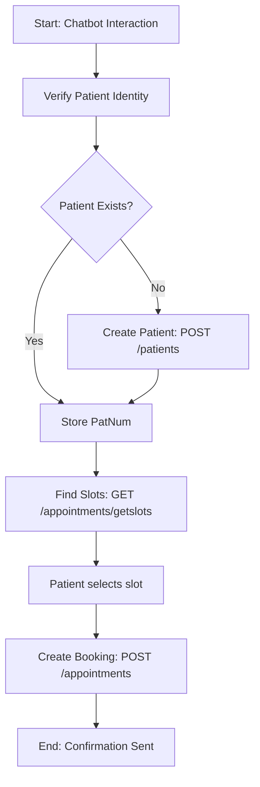

# Open Dental Booking Integration Guide

This guide describes how to integrate your system and Chatbot with **Open Dental** to manage real-time patient booking, schedule checks, and appointment management.

---

## Table of Contents
1. [Sandbox & Testing Environments](#1-sandbox--testing-environments)
2. [Clinic Configuration (What the Client Must Do)](#2-clinic-configuration-what-the-client-must-do)
3. [Managing Schedule Availability (Opening & Closing Slots)](#3-managing-schedule-availability-opening--closing-slots)
4. [Chatbot Booking Workflow (API Reference)](#4-chatbot-booking-workflow-api-reference)
5. [Real-Time Synchronization (Webhooks)](#5-real-time-synchronization-webhooks)

---

## 1. Sandbox & Testing Environments

To build and test the integration safely without affecting real customer/patient databases, you have two primary options:

### Option A: Open Dental's Hosted Test Database (Cloud Sandbox)
* **What it is:** Open Dental hosts a sandbox demo database in the cloud that developers can query.
* **How it works:** When you get access to the Developer Portal, Open Dental will provide you with a specific **Test Customer API Key** and endpoint credentials.
* **Safety:** Any bookings, searches, or updates sent to this test database **only happen in the sandbox** and will never touch any real clinic's system.

### Option B: Local Sandbox Environment (Recommended)
Because Open Dental is a desktop database application, the most reliable testing method is running a local copy:
1. **Download Open Dental Trial:** Install the trial version of Open Dental on your local Windows PC (which includes a demo clinic database).
2. **Run the API Service:** Start `OpenDentalAPIService.exe` on your local machine to expose the local REST endpoint at `http://localhost:30223/api/v1/`.
3. **Test Locally:** You can query, book, and edit appointments in your local code, and immediately see the results update in the local Open Dental desktop interface.

> [!IMPORTANT]
> **Sandbox vs. Production Keys:** 
> * **Sandbox Customer Key:** Only connects to sandbox/test databases. It will NOT affect live production databases.
> * **Production Customer Key:** Generated inside the clinic's live Open Dental system. Once you replace the sandbox customer key with the production customer key, the API starts modifying the client's actual calendar.

---

## 2. Clinic Configuration (What the Client Must Do)

To connect their live clinic to your integration, the clinic admin needs to perform the following steps:

1. **Enable API eService:**
   * The client must contact Open Dental support and subscribe to **API eServices** (usually a flat monthly fee charged to the clinic).
2. **Ensure eConnector is Running:**
   * Open Dental relies on a service called **eConnector** (installed on the clinic's local server) to bridge cloud API requests to their local database. The client must make sure this service is running.
3. **Generate a Customer Key:**
   * Go to **Setup > Advanced Setup > API** in their Open Dental desktop software.
   * Click **Add** to create a new integration token.
   * Select your developer integration, copy the generated **Customer Key**, and share it with your backend team securely.

---

## 3. Managing Schedule Availability (Opening & Closing Slots)

Your chatbot queries availability in real time. The clinic staff **manages all schedule availability inside Open Dental** using standard workflows. The API automatically respects these settings:

| Feature | How Staff Manages It in Open Dental | Impact on API Slot Retrieval (`getslots`) |
| :--- | :--- | :--- |
| **Regular Hours** | Set in `Setup > Appointments > Schedule`. Staff can define working hours (e.g., 8:00 AM - 5:00 PM) for each Dentist and Hygienist (Providers). | The API will only show slots during these defined provider hours. |
| **Operatories** | Defined in `Setup > Appointments > Operatories`. These represent physical chairs. | Slots are only returned if a chair (operatory) is open and not already double-booked. |
| **Lunch & Meetings** | Staff add **Blockouts** (coloured slots on the schedule grid) for lunch, staff meetings, or office breaks. | The API automatically blocks these times and **excludes** them from available slots. |
| **Holidays / Closed Days** | Set in the clinic calendar as a "Holiday" or by removing provider schedules for that date. | The API returns **zero** slots for these dates. |
| **Provider Leaves** | When a provider is on vacation or sick leave, their schedule is cleared from the database. | The API will not return slots for that provider during their absence. |

---

## 4. Chatbot Booking Workflow (API Reference)

Below is the step-by-step API integration cycle for booking via a chatbot.

### Authentication Headers
For all REST API calls, combine your `Developer Key` and `Customer Key` using standard HTTP Basic Authentication:
```http
Authorization: Basic Base64(DeveloperKey:CustomerKey)
Content-Type: application/json
```





### Step 1: Patient Matching (Check if Patient Exists)
Before booking, search if the patient is already in the database.
* **Endpoint:** `GET /patients`
* **Query Parameters:** `LName`, `FName`, `Birthdate` (e.g., `1990-01-20`)
* **Request:**
  ```http
  GET https://api.opendental.com/api/v1/patients?LName=Doe&FName=John&Birthdate=1990-01-20
  ```
* **Response (Success):**
  ```json
  [
    {
      "PatNum": 1052,
      "FName": "John",
      "LName": "Doe",
      "Birthdate": "1990-01-20",
      "HmPhone": "555-0199"
    }
  ]
  ```

*If the list is empty, call `POST /patients` with their name, DOB, and phone/email to create a new patient record and obtain a new `PatNum`.*

---

### Step 2: Fetch Available Booking Slots
Query available times based on dates and durations.
* **Endpoint:** `GET /appointments/getslots`
* **Query Parameters:**
  * `dateStart`: Start date (`YYYY-MM-DD`)
  * `dateEnd`: End date (`YYYY-MM-DD`)
  * `lengthMinutes`: Duration of the procedure (e.g., `40`)
* **Request:**
  ```http
  GET https://api.opendental.com/api/v1/appointments/getslots?dateStart=2026-05-21&dateEnd=2026-05-22&lengthMinutes=40
  ```
* **Response:**
  ```json
  [
    {
      "AptDateTime": "2026-05-21 09:00:00",
      "OpNum": 3,
      "ProvNum": 1
    },
    {
      "AptDateTime": "2026-05-21 10:30:00",
      "OpNum": 3,
      "ProvNum": 1
    }
  ]
  ```

---

### Step 3: Book the Appointment
Once the patient selects a slot, lock in the booking.
* **Endpoint:** `POST /appointments`
* **Payload:**
  ```json
  {
    "PatNum": 1052,
    "Op": 3,
    "ProvNum": 1,
    "AptDateTime": "2026-05-21 10:30:00",
    "AptStatus": "Scheduled",
    "Pattern": "//XXXX//",
    "Note": "Booked automatically by Dental Chatbot."
  }
  ```
* **Response (Success):**
  ```json
  {
    "AptNum": 98765,
    "PatNum": 1052,
    "AptDateTime": "2026-05-21 10:30:00",
    "AptStatus": "Scheduled"
  }
  ```
  *(Save `AptNum` in your system to allow the patient to cancel or reschedule later)*.

---

### Step 4: Cancel or Reschedule
If a patient wants to change or cancel their appointment through the chatbot:

* **Rescheduling:** Update the `AptDateTime` and `Op` on the appointment record.
  * **Endpoint:** `PUT /appointments/{AptNum}`
  * **Payload:**
    ```json
    {
      "AptDateTime": "2026-05-21 14:00:00"
    }
    ```

* **Canceling (Breaking):** Mark the appointment as broken.
  * **Endpoint:** `PUT /appointments/{AptNum}/break`
  * **Description:** This automatically unschedules the slot, tags it as cancelled in logs, and frees up the calendar slot for other bookings.

---

## 5. Real-Time Synchronization (Webhooks)

If clinic staff reschedule or cancel an appointment manually inside the Open Dental office software, your chatbot backend must sync that change.

1. Register a Webhook URL:
   * **Endpoint:** `POST /subscriptions`
   * **Payload:**
     ```json
     {
       "SubscriptionType": "Appointment",
       "URL": "https://your-bot-backend.com/webhooks/appointments"
     }
     ```
2. Whenever an appointment is created, modified, or broken inside the clinic, Open Dental will send an HTTP `POST` event to your URL. Update your database and chatbot context accordingly.
